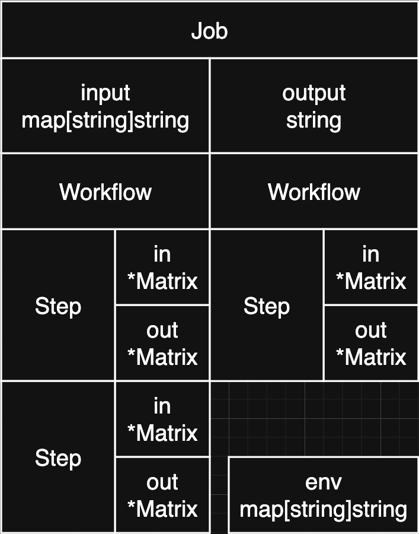

# YFlow (Yaml Workflow Engine)

[简体中文](./README-zh.md)

A declarative workflow engine based on YAML configuration, allowing you to define complex data processing workflows through YAML, helping you turn Dirty Work into Clean Work.

## Features

* 🚀 **Declarative Configuration**: Define data processing workflows using YAML.
* 🔌 **Multiple Data Sources**: Connect to various data sources easily with just one ``Step``.
* 📊 **Data Transformation**: Provides rich matrix operation functions.
* ⚡ **Function Expressions**: Built-in [bilibili/gengine](https://github.com/bilibili/gengine) rule engine.
* 🔄 **Multi-Workflow Support**: Execute multiple workflows in parallel.
* 🧩 **Excellent Extensibility**: Easily extend ``Step`` and ``Function``.

## Quick Start

### Installation

```` bash
go get github.com/leeyaf/yflow
````

### Example

[A Relatively Complex Example](./_examples/mysql/README.md)

## Configuration Guide

### Basic Structure

```` yaml
name: myflow
input: # Raw input
  - age: int # Type definitions are engine-agnostic and can be used by the frontend (web client)
  - phone: phoneNumber
workflows:
  - workflow: # First workflow
    - step: Test # Name of a registered Step
      name: result # Step name (optional)
      in: # Input matrix
        - a # First row
        - b # Second row
  - workflow: # Second workflow (executed in parallel)
    - step: Test
output: result.out # Points to the Step's matrix
````

### Function Expressions

In the YAML configuration, the ``in`` parameter for all ``Step``s can use ``${YourExpression}``.

| Expression | Description |
| ----- | --- |
| ${prev.in} | Input matrix address of the previous ``Step`` |
| ${prev.out} | Output matrix address of the previous ``Step`` |
| ${yourStepName.in} | Input matrix address of the specified ``Step`` |
| ${input.age} | Get value from ``input`` |
| ${env.mysqlUri} | Get value from ``env`` |
| ${ParseInt("6")} | Call a ``Function`` |
| ${10*3} | Simple mathematical operation. Refer to [bilibili/gengine语法](https://github.com/bilibili/gengine/wiki/语法) |

* Directly available ``Step``s are in [registed_step.go](./registed_step.go). See example [registed_step_test.go](./registed_step_test.go).
* More ``Step`` implementations:
  * [MySQL](./_examples/mysql/step_mysql.go)
  * [Redis](./_examples/redis/step_redis.go)
* Directly available ``Function``s are in [registed_function.go](./registed_function.go). See example [registed_function_test.go](./registed_function_test.go).

### Other Notes

* Because elements in the ``Matrix`` are of type ``string``, the output of function expressions will be converted to ``string``.
* When writing YAML, if a string actually represents multiple values, separate them with spaces (``shell-style``).

## Development Guide

### Adding a ``Step``

```` go
func sMyStep(s *yflow.Step, in *yflow.Matrix, out *yflow.Matrix) {
    // Write processing results to 'out'
}

yflow.RegistStep("MyStep", sMyStep)
````

### Adding a ``Function``

```` go
// For functions that do NOT need access to the current Step
func fMyFunction(value string) string {
    return "hello " + value
}

yflow.RegistFunction("MyFunction", fMyFunction)

// For functions that DO need access to the current Step
func fMyFunction2(step *yflow.Step) any {
    return func(matrixName string) string {
        rows, cols := step.GetMatrix(matrixName).Shape()
        return fmt.Sprintf("%v, %v", rows, cols)
    }
}

yflow.RegistFunctionWithStep("MyFunction2", fMyFunction2)
````

## Memory Model



## Background

Previously, when I served as the lead server programmer at a gaming company, after the game launched, operations and planning teams continuously requested data and reports from the server. Among these requests, some were one-time, while others were recurring. My initial strategy was simple: evaluate the nature of the request (short-term vs. long-term). Long-term needs were implemented in code, and one-time requests were handled with SQL + Excel. However, the problem was: many supposedly one-time requests would suddenly reappear one day. Recalling the lengthy steps I had previously implemented, I wondered: Could there be a low-cost way to formalize these lengthy procedures?

Thus, I conceived and developed the original version (internal company code ``fakegm``). With ``fakegm``, we met various demands at a very low cost and no longer needed to evaluate their long-term or short-term nature (treating all as long-term). As it evolved, our server-side business code was eventually reduced to just login, timers, and other essentials; everything else became implementations of various ``Step``s. The codebase shrank, but functionality became richer. We integrated numerous data sources: MySQL, Redis, Kubernetes, AliyunOSS, AliyunImage, GrafanaCloud, internal configuration management platforms, and internal game servers. On the frontend (web interface), aside from the basic ``Job`` management and execution page, we also created dedicated, polished pages for some particularly high-frequency needs. Of course, the basic ``Job`` management page could already fulfill all requirements, but the customized pages struck the perfect balance for various stakeholders.

After accomplishing all this, we even began to look forward to various requests whose nature (long-term or short-term) was unclear: when existing ``Step``s could meet the need, writing a YAML file would deliver the result; when existing ``Step``s fell short, it was an opportunity to add a new one to our ``Step`` library!

Now, ``yflow`` inherits the purest essence of ``fakegm``, completely recoded and redesigned to make Clean Work even cleaner.

## Contribution

``Step``s and ``Function``s that are generally useful, fundamental, and not biased towards specific projects are registered by default. Those with a specific bias should be placed in ``/_examples/``.

Issues and Pull Requests are welcome!

1. Fork the project
2. Create a feature branch
3. Commit your changes
4. Push to the branch
5. Create a Pull Request

## License

MIT License